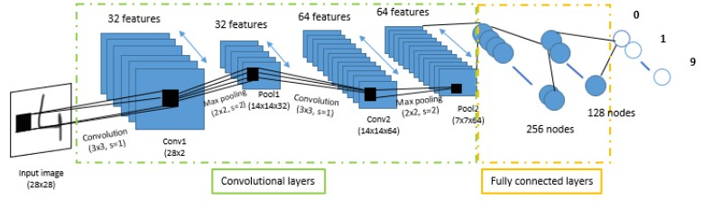
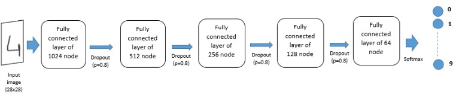

# PSD Digits Recognition Project

This repository contains the source code of our work on the final year project on Data Science which aims to classify digits from images using Deep Learning technics.
Please find the MNIST data, which the model was trained on, on [kaggle](https://www.kaggle.com/c/digit-recognizer) .
We trained the MNIST dataset on both CNN and a Fully Connected Network.

## The CNN

## The Multi Layer Perceptron 

## Results on the test set  

Using:

    **CNN** : 0.99157
    **Fully Connected Network** : 0.96414

*Authors of this work are :*  

    Sara EL-ATEIF and Kévin DEGILA

*Supervisor :*
    
    Prof. Mohamed BOUSMAH

*From:* 

    National School of Applied Sciences of EL Jadida (ENSAJ)
    Field : Engineering in Computer Science and Emerging Technologies

*Related Works:*  

    Y. LeCun, L. Bottou, Y. Bengio, and P. Haffner, “Gradient-based Learning Applied to Document Recognition,” Proceedings of the IEEE, vol. 86, no. 11, pp. 2278–2324, 1998.

    A. El-Sawy, E.-B. Hazem, and M. Loey, “CNN for Handwritten Arabic Digits Recognition Based on Lenet-5,” in International Conference on Advanced Intelligent Systems and Informatics. Springer, 2016, pp.566–575.